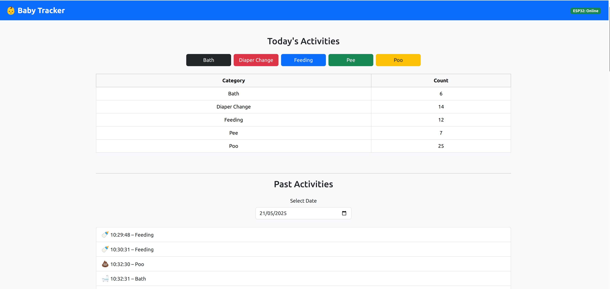

# Day 5 -- Historical Data Logs

## Summary

Today we focused on improving the **usability and historical visibility** of the Baby Tracker dashboard. The UI is now much more intuitive, visually informative, and ready for future analytics and automation.

## What Was Done

### 1. **Past Activity Viewer Implemented**

* Added a new section to the Dashboard for selecting a past date and viewing logs.
* Created a new component `PastLogList` to display log entries in a human-readable list:

  ```
  🕒 16:42:57 – Diaper Change
  🕒 17:10:05 – Pee
  ```
* Removed redundant date display (only shows time).
* Added icons to match activities:

  * 🍼 Feeding
  * 💩 Poo
  * 💧 Pee
  * 🛁 Bath
  * 🧷 Diaper Change
  * ⚡ Power-on (fallback)

### 2. **Backend Updated to Use Database for History**

* Modified `/api/logs/export/<date>` to load historical logs from the PostgreSQL database instead of the ESP-only `baby-logs/*.txt` files.
* Ensured both web and ESP entries are included in the result.

### 3. **Log Buttons Improved**

* Removed redundant `(Color)` label from each activity button.
* Styled buttons with background colors matching the physical buttons:

  * `btn-danger` for Red (Diaper)
  * `btn-primary` for Blue (Feeding)
  * `btn-success` for Green (Pee)
  * `btn-warning` for Yellow (Poo)
  * `btn-dark` for Black (Bath)

### 4. **Button Layout Standardized**

* All buttons now have equal width (`min-width: 140px`), improving alignment and UX.
* Responsive layout retained using `flex-wrap` and `gap-2`.

## Verified

* Date selector loads and displays correct entries for past days.
* Activity icons map correctly from database `color` field.
* Button presses from the web UI are immediately reflected in today's log.
* Styling is consistent across devices and screen sizes.

## Next Steps

* [ ] Add charts for daily activity distribution (bar chart, timeline).
* [ ] Implement smart reminders (e.g., "Time to feed").
* [ ] Begin planning MQTT-based event publishing from ESP32.
---

