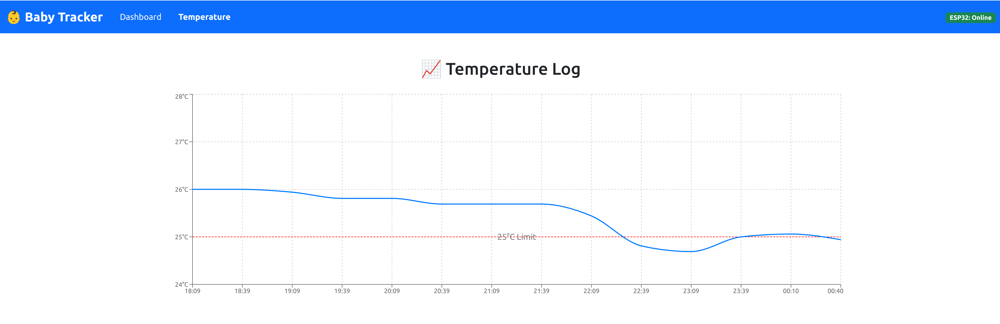

# Day 7 - Full Stack Enhancements & Stability Fixes

## Summary

This session involved **major upgrades across firmware, backend, and frontend**, including button combo handling, display logic, database schema, timezone alignment, and real-time synchronization. I have enhanced both **data integrity** and **user experience**, pushing the project significantly closer to MVP completion.

## ESP32 Firmware Improvements

*(Hardware-related changes tracked in firmware repo, so only high-level logic is noted here)*

* ✅ Rewrote `loop()` to properly detect button **press edges** and **combo presses** (e.g. Blue + Black to clear logs, Red + Yellow to record a combo diaper event).
* ✅ Switched all buttons to use `INPUT_PULLDOWN` to avoid noisy false presses on boot.
* ✅ Fixed logic for combo debounce using timestamp difference with `abs(...) <= 500`.
* ✅ Implemented display updates via `ST7789` for each event type.
* ✅ Added MQTT publishing for each valid event in proper JSON format.
* ✅ Displayed messages for all combinations, including single-press and dual-press.

## Backend (Flask) Changes

* ✅ Updated `/api/logs/today` and `/api/logs/export/<date>` endpoints to reflect changes
* ✅ Confirmed all timestamps are parsed/stored in **UTC+8 (Asia/Shanghai)** timezone
* 🧪 Encountered issue with schema mismatch — attempted Flask-Migrate setup but later dropped/recreated DB manually

## Frontend (React) Changes

* ✅ Modified MQTT connection in `DashboardPage.jsx`:

  * Subscribed to `esp32/babytracker/logs` via `mqtt.js` WebSocket
  * Parsed and matched message dates using **China timezone** logic via:

    ```js
    new Date().toLocaleString('en-CA', { timeZone: 'Asia/Shanghai' }).slice(0, 10)
    ```
* ✅ Fixed `selectedDate` initialization to reflect China-local time
* ✅ Fixed a bug where today's logs were duplicated in both "Today" and "Past Activities" due to timezone mismatch
* ✅ Added chart to show baby formular box's temperature
* ✅ Clarified code path that triggers reload of logs after new MQTT message is received
---


## Other Work

* ✅ Ensured `temp_data.json` in `frontend/public` is `.gitignore`d and not tracked by Git
* ✅ Discussed and tested `LogTable.jsx` sorting/entry display for activity counts
* ✅ Updated activity icons including:

  * 🛏️ for Sleep
  * ⏹️ for Stop
* ✅ Started discussion on adding UI/DB support for displaying **total diaper count**

## Next Steps

* [ ] Fully implement and expose `diaper` count in frontend (UI and API)
* [ ] Refactor ESP32 firmware to separate display logic from log logic (optional)
* [ ] Consider Flask-Migrate for future schema management
* [ ] Enable log export for historical sessions with diaper count summaries
* [ ] Add alerting for long gaps (e.g. no feed for 3 hours)
